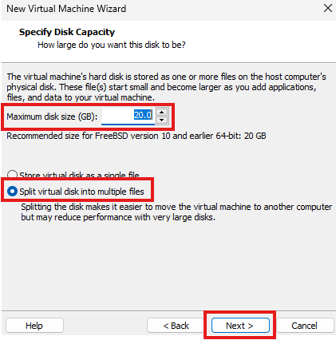
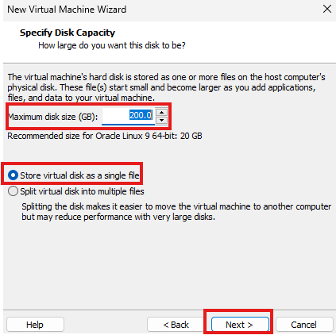
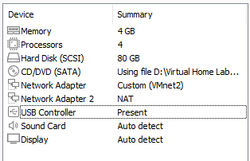

# Virtual Homelab
Hands on experience for System Administration, Networking, and Cybersecurity. This guide was inspired by [Cyberwox's Lab](https://cyberwoxacademy.com/building-a-cybersecurity-homelab-for-detection-monitoring/) but required additional troubleshooting and configuration since his guide was outdated.

# What is a Virtual Homelab?
A virtual homelab is a simulated enviroment designed to replicate the components and configurations of an enterprise-level IT infrastucture. It's purpose is to provide hands-on experience with installing, configuring, maintaining, and updating various systems and services.

# Tools
- Hypervisor - VMWare
- Attacker - Parrot OS
- Analyst - Ubuntu Desktop
- Vulnerable Machines - Ubuntu, Windows, DVWA
- Domain Controller - Windows Active Directory
- Firewall - pfSense
- IDS - SecurityOnion
- SIEM - Splunk

# Network Design


# Guide
## Download and Install VMWare Workstation

[VMWare Workstation Download](https://support.broadcom.com/group/ecx/productdownloads?subfamily=VMware+Workstation+Pro)

## Install and Configure the Firewall - pfSense

[pfSense ISO Download](https://www.pfsense.org/download/)

1. Open VMWare Workstation and create a new Virtual Machine with the "Typical (recommended)" setting. 
   
2. Browse for the pfSense ISO file and select "Next".    


3. Change your VM name to "pfSense" & click "Next".
   
4. Leave the disk size at 20GB and ensure the "Split virtual disk into multiple files option" is selected.
   


5. Click on customise hardware and increase the memory limit to 2GB.

6. Add 5 Network Adapters and correspond them with a VMnet interface as per the image. 


7. Select "Finish". The pfSense machine will power on and you can accept all the default values, after that pfSense will boot.

8. Press "Install", and select all the default configurations. 


9. After pfSense is done rebooting you will reach this screen.
     


10.  Select "Option 1" to set up the VLAN. Followed by: 
    
**'Should VLAN's be set up now [y|n]?'** - n

Enter the interfaces in respective order for each prompt:
1. em0 -> WAN
2. em1 -> LAN
3. em2 -> Optional 1
4. em3 -> Optional 2
5. em4 -> Optional 3
6. em5 -> Optional 4

**'Do you want to proceed [y|n]?'** - y


11.  Select "Option 2" and then select 2 again.

For this tutorial, use the IP Address **192.168.1.1** to access the pfsense WebGUI. Configure the LAN Interface same as below.


For, **'Do you want to revert to HTTP as the webConfigurator protocol? (y/n)'** - n

12. Use the configuration below for the OPT1 interface.


13. Use the configuration below for the OPT2 interface.


14. The OPT3 Interface should be left without an IP as it is going to have the span port with traffic that the IDS (Security Onion) is going to be monitoring.

15. Use the configuration below for the OPT4 interface,


16. Part of the pfSense configuration is not complete. The rest of the configuration will be done using the Parrot Machine through the WebConfigurator.

## Installing and Configuring the IDS - Security Onion
[Security Onion Download](https://securityonionsolutions.com/software)

1. Open VMWare Workstation and create a new Virtual Machine with the "Typical (recommended)" setting.
   
2. Browse for the Security Onion ISO file and select "Next".    
   


3. Put in SecurityOnion as the VM name and select "Next"


4. Allocate a minimum of 200GB disk size and make sure to store it as a single file then click "Next".



5. Click "Customise Hardware" -> Increase Processors to 4 -> Change memory to 12GB - 16GB -> Add 2 Network Adapters and assign them Vmnet4 & Vmnet5.


6. Click "Finish" and bootup the "SecurityOnion" VM -> Click "Enter" on "Advanced Install Options" -> Click "Enter" on "Install Security Onion 2.4.110 in Basic Graphics Mode".


7. After loading, enter "yes" when you get this prompt.


8. Set a username and password for the administrator account -> After Security Onion reboots enter those credentials -> Select "Yes".

 

9. Select "Run the standard Security Onion installation".

10. Select the EVAL option.


11. Type "Agree".

12. Select a hostname, I kept the default.

13. Use spacebar to select ens160 as the management interface -> Press Enter.


14. Select DHCP to set up the the management interface.

15. Select "YES" -> Select "OK" -> Select "Standard" for how this manager should be installed. 

16. Select "Direct" -> After the preflight checks, select ens224 as the Monitor Interface.


17. Select "Automatic" for the OS patch schedule -> Accept all default values.

18. Enter an Email Address and password for the Admin account.

19. Select "IP" for access to web interface -> Select "Yes" for NTP server and accept the defaults.

20. Enter "192.168.3.10" when asked for an IP address to access Web Interface.


21. Take a screenshot of the final settings.


22. This prompt signals the end of the Security Onion installation.


23. After installing Security Onion, access to the web interface will be done from an external Ubuntu Desktop simulating a SOC/Security Analyst accessing a SIEM or any other tool from their device.

[Ubuntu Desktop Download](https://ubuntu.com/download/desktop)

[Ubuntu Desktop OS Installation Guide on VMWare](https://medium.com/@florenceify74/how-to-download-install-and-run-ubuntu-in-vmware-workstation-ce5f2d4d0438)

24. Add an Ubuntu Desktop VM and get the IP Address of the machine. Once you have the IP, add it to the Security Onion instance by running the command:

```
sudo so-firewall 
```
25. Enter your password

26. Run the following commands
    
```
sudo so-firewall includehost <group_name> <ip>
```

```
sudo so-firewall apply 
```

27. This marks the end of the Security Onion configuration. You can now access the Security Onion SOC Portal on the Ubuntu Machine.


## Configuring Parrot OS Machine

Parrot OS will be used as an attack machine to propagate different forms of offensive actions against the Domain Controller and the other machines attatched to it.

[Parrot OS Download Link](https://www.parrotsec.org/download/)


[Parrot OS Installation Guide on VMWare](https://www.parrotsec.org/docs/parrot-on-vmware.html)

1. Open VMWare Workstation and create a new Virtual Machine with the "Typical (recommended)" setting.
   
2. Browse for the Parrot OS ISO file and select "Next".    
   


3. Put in Parrot OS as the VM name and select "Next"

4. Allocate a minimum of 80GB disk size and make sure to store it as a single file then click "Next".

5. Click "Customise Hardware" -> Increase Processors to 4 -> Change memory to 4GB -> Add and assign a network adapter to Vmnet2.



7. Click "Finish" and bootup the "Parrot OS" VM.

8. After powering on, use the following command to change the default password to a more secure one.

```
passwd
```
Parrot OS is now ready to use.


## pfSense Interfaces and Rules
Now that the Parrot OS machine is setup, the pfSense WebConfigurator can be accessed in order to make some changes to the pfSense interface and firewall rules.

1. Navigate to the web browser and search for **192.168.1.1**
   
2. Select "Advanced...".   
   
3. Select "Accept the Risk and Continue"

4. Sign in to pfSense using default credentials **"admin"** & **"pfsense"**.


5. Click "Next" until you get to **"Step 2 of 9"**.

6.  Add **8.8.8.8** as the "Primary DNS Server".

7.  Add **4.4.4.4** as the "Secondary DNS Server".

8. Click "Next".


9. Choose your timezone and then click "Next".

10. Untick the last 2 boxes and click "Next".


11. Click "Next" on **"Step 5 of 9"**.

12.  Set a new Password and click "Next".

13.  Click "Reload".

14.  Click "Finish".

15. Navigate to the "LAN" section under the "Interfaces" tab.


16. For "Description", change "LAN" to "Parrot" as this is the Parrot interface -> Click "Save".

17. Configure the rest of the interfaces as shown below:


18. For OPT3 tick the "Enable interface" box.

19. Navigate to the "Assignments" section under "Interfaces"

20. Go to the "Bridges" section and click "Add"


21. Select "Victim Network" as the "Member Interface" and then click "Display Advanced"


22. Select the "SPANPORT" option for "Span Port" in the "Advanced Configuration" section. -> Click "Save"

23. Click "Rules" under the "Firewall" dropdown.


24. Select the "Add" button with the arrow pointing down.

25. Set "Protocol" to "Any" under the "Edit Firewall Rule" section. -> Click "Save"

## Configuring Windows Server as a Domain Controller
The goal of this portion of the lab is to setup an Active Directory domain with Windows Server 2022 as the Domain Controller and 2 Windows 11 machines.

[Windows Sevrver 2022 Download](https://www.microsoft.com/en-us/evalcenter/evaluate-windows-server-2025)

[Windows 11 Download](https://www.microsoft.com/en-us/software-download/windows11)

1. Open VMWare Workstation and create a new Virtual Machine with the "Typical (recommended)" setting.


2. Do not worry about a product key, click "Next" and then "Yes".

3. Put in Windows Server 2022 as the VM name and select "Next"

4. Allocate a minimum of 60GB disk size then click "Next".

5. Click "Customise Hardware" -> Increase Processors to 2 -> Change memory to 2GB -> Add and assign the network adapter to Vmnet3 .


7. Click "Finish".

8. Edit the virtual machine again and remove the floppy drive.

9. Power on the VM and immediately click any key.

10. Click "Next" and then "Install".


11. Select the "Windows Server 2019 Standard Evaluation (Desktop Experience)" and click "Next".

12. Accept the terms and conditions and click "Next".

13. Select "Custom Install" -> "New" -> "Apply" -> "Okay" -> "Next"


14. Once complete, create a password and then click "Finish".


15. Login with your new password. You will come to the following screen:


